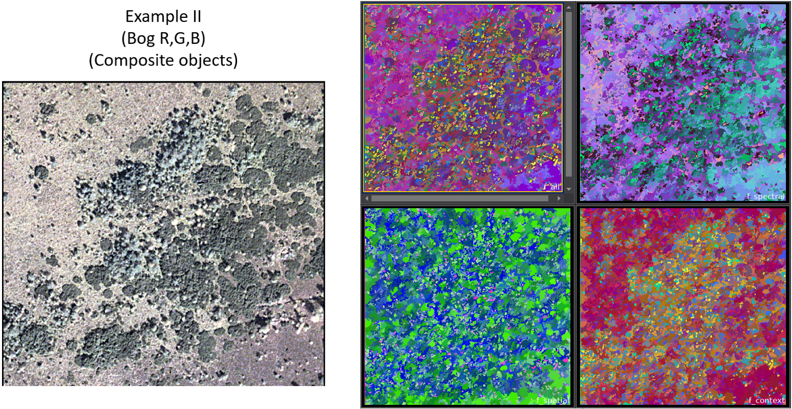

## Feature EDA - Knowledge Discovery in OBIA

The project is currently in the development phase. If you encounter any bugs, please open an issue or pull request...

## I. Background & Idea

Object-based image analysis (OBIA) concerns the creation and analysis of image-objects as groups of contiguous pixels representing real-world geographic objects. These image-objects can be evaluated in terms of their spectral, textural, geometrical, and contextual features enabling to classify the objects in a manner that mimics the human vision. The analysis of object features can be realised in different settings ranging from knowledge-based rulesets to sample-based supervised machine learning approaches. In both cases, a meaningful feature formation is a pivotal prerequisite for the performance of the model. In the branch of supervised learning algorithms, feature selection may not be necessary as there are some standard models (such as Random Forests (RF)) well-known for their robustness and capability to handle large amounts of redundant features. Also, taking the example of RF, automated evaluation of feature importances is included, which can be used for a feature selection, if necessary. However, the are reasons for sticking with a knowledge-based ruleset approach instead of a data-driven evaluation of object features. The most simple one may be the lack of reference data rendering the application of supervised algorithms infeasible. Increased transparency in the sense of an explicit formulation of decision rules may be another reason for sticking with ruleset-based approaches. For knowledge-based modelling - in contrast to machine learning based approaches - the engineering & selection of meaningful features is really crucial as they are directly used to formulate the decision rules. 

The complexity of finding meaningful features in the framework of a knowledge-based approach depends on the specifics of the input data as well as on the characteristics of the given problem, i.e. possibilities to make the knowledge about the task at hand explicit and tangible using available features. This may be trivial in the case of bona-fide objects that can be clearly delineated visually and have easily definable characteristics (e.g. forest vs. urban areas). However, especially in case of composite objects, expressing functional rather than spectral homogeneity (e.g. biotops), this can be much harder. Modelling such composite objects adequately may require a combination of multiple features in a complex way for creating an expressive ruleset. Sometimes, the identification of feature combinations that approximate the classification of objects in the way they are perceived by experts is done in a trial-and-error manner rather than a targeted, knowledge-driven way. In short: There is knowledge about the given problem, so a knowledge-based approach makes sense in principle. But the knowledge is too fuzzy or implicit to transfer it directly and in a targeted way into a ruleset.

This is the starting point for the tool compiled here, which is intended to enable an explorative analysis of the combined expressiveness of several object features. For this purpose, multidimensional feature spaces are reduced to 3 dimensions, which can then be visualised as RGB. Similarities between objects in relation to the given input feature combination are thus easily visible. In comparison with the expert-based interpretation of the image, the process of identifying helpful/less helpful feature combinations can thus be made easier and more targeted.

## II. Tool description

### A. Scope & Limitations

The presented tool is primarily designed as a method that supports exploratory data analyses. In essence, the tool does not do much more than a dimensionality reduction and subsequent visualisation of the results. Accordingly, no miracles are to be expected. The tool doesn't give you direct class descriptions nor some specific rules to derive at them. Rather, it allows the similarity of objects in a multi-dimensional feature space to be examined. 

In particular, it should be pointed out that the established basic principles of & rules for OBIA class modelling are still valid. The singificance of scale, for example, is still in place. Re-running the feature EDA based for segmentations of different scales will, of course, lead to changes in the similarity of objects regarding specific features. Maybe less obvious but still important to note: The case of logical grouping of objects based on sematic inheritance that does not directly translate into feature-based similarity can not be discovered using the current tool. One example for this would be the identification of buildings, streets, airport runways, quays and sealed bottom pools as sealed surfaces. As this is a semantic rather than feature-based connection corresponding objects will most likely not be grouped as similar in the visualisation of embeddings (i.e. the reduced feature space).

Some other non-OBIA specific limitations of this tool:
* Until now, only images with a maximum of 4 bands are supported - at least if you want to rely on the pre-defined feature sets (see C. Implementation). If you choose your own feature sets to be analysed, more than 4 bands are fine as well.
* If your segmentation outputs >> 1000 objects, reconsider a coarse scale segmentation or grab a coffee and be patient ;)  

### B. Uniform Manifold Approxiamtion & Projection (UMAP)

The implemented dimensionality reduction algrotihm UMAP is a state-of-the-art method for visualising & exploring high-dimensional feature spaces. In the field of dimensionality reduction techniques, UMAP belongs to the class of k-neighbour based graph learning algorithms. This group of non-linear dimensionality reduction techniques contrasts with matrix factorisation techniques such as PCA, which perform a global linear mapping of high-dimensional data to low dimensional representations. Graph-based algorithms work as follows: First, a weighted graph of the high-dimensional data is constructed and then a translation of this graph into low dimensional space preserving its desirable characteristics is performed. The low dimensional representation is adjusted iteratively according to the optimising function quantifying the similarity of the low-dimensional to the high-dimensional graph in terms of the defined criteria. UMAP shares this working principle with a range of other graph-based dimensionality reduction approaches such as the t-SNE and Laplacian eigenmaps. However, UMAP seems to be superior to t-SNE in terms of capturing the global and topological structure of a given dataset. Furthermore, the algorithm scales better with larger datasets and shows better run time performance. This is of crucial importance from a practical point of view as segmenting images into several hundred or thousands of objects is rather common. Still, the iterative numerical approach underlying UMAP leads to runtimes that are orders of magnitude longer than those of analytically solvable reduction algorithms.    

For in-depth explanations on UMAP and comparisons to PCA, taking a closer look at the original publication (<a href="https://doi.org/10.48550/arXiv.1802.03426">McInnes et al. 2018</a>) is highly recommended. A more graphically oriented explanation of the working mechanism of UMAP can be found <a href="https://umap-learn.readthedocs.io/en/latest/how_umap_works.html">here</a>. Also, the <a href="https://pair-code.github.io/understanding-umap/">following website</a> provides interactive resources for gaining an intuitive understanding.

### C. Implementation

Most parts of the data preparation & data visualisation are done directly using ecgonition functionality. For the main part (UMAP dimensionality reduction) the created objects with their feature values are exported. Features are evaluated using the umap python library and the results are written back to the ecognition project. Altogether, this pipeline should run smoothly from within ecognition once the necessary python environment is in place (-> see `requirements.txt`).       

From the users point of view, the tool offers two ways of exploring feature sets - one based on user-defined feature sets & one based on pre-defined feature sets. The possibility mentioned first refers to the user choosing his/her own features of interest that should compose the high-dimensional feature space of interest. Contrary, the pre-defined featuresets are provided in case there is no idea on which features may be useful at all (and also to allow a demonstration of the tool with minimal user input being required). A total of 4 feature sets is implemented - "f_all", "f_spectral", "f_spatial", "f_contextual".   

### D. Ecognition visualisation

The following two figures visualise the output of the current tool applied to the provided sample data. In both cases a multi-resolution segmentation (scale: 40, shape: 0.2, compactness: 0.7) was used to create objects. The visualised feature sets are the pre-implemented ones.   

For the first example, one can easily see that the spectral feature set delivers an almost ideal classification of objects. This emphasises the bona-fide character of the objects that are present in the scene. The river, isolated buildings and vegetated areas are objects that can be identified & delineated quite easily. Testing different complex feature sets for this given problem may not even be necessary. Still, a simple and quick check of different feature sets can provide some valuable additional insights. Taking a closer look at the contextual feature set, for example, it is clear that this group of features is particularly useful for classification of isolated trees along the river (displayed in red in f_context). Depending on the specific goal of the classification, the user can thus draw the conclusion on which features should be included in the subsequent analyses.        

The second example of a degraded bog is closer to the described scenario of composite object analysis. Different bog areas can not be delineated simply based on the existence of single plants but need to take the structural composition of areas into account. Corresponding to the increased complexity of this image analysis task, the applied feature eda can also not be expected to lead to a ready-to-use object classification (<i>necessity of hierarchical modelling -> see Scope & Limitations </i>). Still, the user may gain some insights from this exploratory analysis for developing a ruleset on the first scale level. For example: Let's take a closer look at the areas at the top left and bottom right of the images: both areas are characterised by high homogeneity and the occurrence of few bushes. However, the spectral signature differs visibly. Accordingly, objects of both areas appear similar in the spectral feature set but still distinguishable, whereas the contextual interpretation makes both areas appear the same. This information can be used for modelling on a second hierarchical level. Note that the spatial feature set in the given case appears rather random and may thus be excluded for the subsequent modelling (or re-evaluated using a different initial segementation scale).    

  

### E. Interactive dashboard

To further investigate the meaning and relevance of the embedded feature representation an interactive dashboard is launched when executing the ecognition ruleset. This streamlit-based web app allows to explore the feature space and its connection to the original user-selected features.          

 

## III. Future developments & possibile extensions

The current prototype could be enriched towards a comprehensive toolbox for exploratory data analysis in OBIA. 
* Existing tools for selecting a suitable scale parameter (ESP) could be integrated such that the current tool evolves to something
that enables a fully automated initial object-based image analysis.
* The pre-implemented feature sets could be refined based on expert knowledge on which features can be regarded as useful "standard features" that compose generally well-working feature sets.
* Based on the given embeddings, a cluster procedure could be implemented subsequently to automatically suggest some preliminary classification. The process may be guided by the user by providing input/knowledge on the desired number of classes for example. Subsequently, the feature analysis process could be repeated on a coarser, second hierarchical level - this time including also relations to sub-objects as features under consideration. Note: If the embeddings should really be used as direct input for an automated classification apporach remains to be reflected considering the specific properties of the UMAP algorithm (focus on local similarities, embedding stability, etc).

The following optimisations refer to more technical, code-related aspects:
* Speed-ups can be realised by implementing a multi-core solution for UMAP analysing multiple feature sets in parallel.